# openEuler 工程&版本构建优化方案设计

## 1.背景
openEuler社区版本演进激烈，为了提高单包乃至版本构建成功率，我们希望能将此类由单包变更导致的构建问题拦截在版本分支及工程之外。

openEuler社区软件仓接入OBS构建工程流程较为复杂，开发分支和版本分支对应工程的软件包变更场景有不同的处理流程，对开发者体验不够友好；版本基线软件包范围管控弱，最终发布镜像范围和一致性不可控。我们希望优化release-management管控版本基线和基础镜像二进制变更的流程，归一，易操作。

openEuler 社区构建系统基于OBS搭建，当前版本工程与私有工程由同一套OBS“一手抓”的情况已不能满足版本开发、测试需求， 对于社区开发者和版本构建工程师来说，“构建慢”的现象越来越明显，我们希望基于OBS当前的架构做一下调度资源和构建策略的调整来大大缓解这一现象。

## 2. 需求描述
### 2.1 分层构建
分层构建，或者叫分层流水构建，是指将openEuler版本范围内的软件包按照一定的依赖关系分层创建project，原本有依赖环的包也拆分到上下层，这样每一层有明确的对下层project的repo的依赖关系，每一层有自己的软件包的构建策略。

分层构建针对开发分支相关的开发工程（后面统一称“Testing”）做整改，当Testing所有层的project构建达到稳定状态，允许拉取release分支工程，这种架构一方面是更方便验证单包更新之后对下游包的编译影响，一方面可以提高软件包编译并行度。

需求如下：
|序号|描述|
|:--|:-------|
|1|开发工具支持识别依赖环、导出L1依赖链以及识别语言包|
|2|制定master分支软件包的分层策略|
|3|制定分层project的构建策略|
|4|适配OBS日常维护及ISO制作的jenkins任务|
|5|适配obs_meta与OBS的同步策略，obs_meta的门禁|

### 2.2 优化release软件包管控机制
release sig通过release-management来管控版本分支软件包基线以及变更：
- name: rubygem-zeitwerk
    branch_from: openEuler-22.03-LTS-Next
    branch_to: openEuler-22.03-LTS
    obs_from: openEuler:22.03:LTS:Next
    obs_to: openEuler:22.03:LTS
    change_pr: obs_meta-1362
    date: 2022-03-03-19-03-06

当前release管控版本基线示意图：

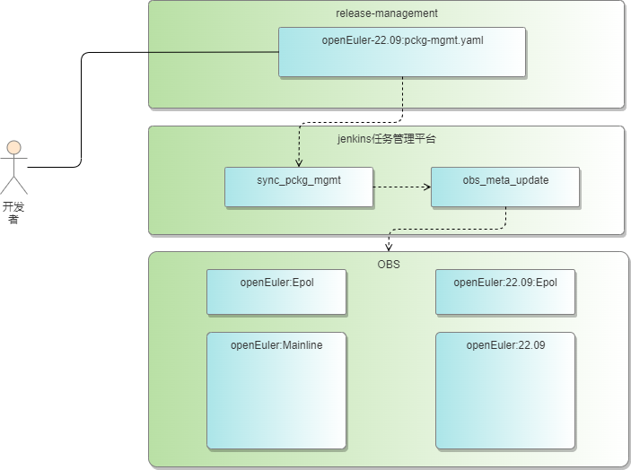
需求如下：

|序号|描述|
|:--|:-------|
|1|pckg-mgmt.yaml拆分：baseos、everything_exclude_baseos、epol、delete|
|2|纳管所有分支工程软件包变更(master/Next/multi-version)：所有obs project/package的增删改通道全部归一，obs_meta只保留project的meta修改通道|
|3|支持承载版本基线软件包变更记录：记录在release_change.yaml中|
|4|规范版本基础镜像二进制变更流程|

### 2.3 Back-end集群扩展
当前openEuler所搭建的OBS系统分为：
- 前端(frontend): 部署了OBS服务的前端组件和服务，包括数据库，网站等。
- 源代码端(source): 部署了OBS服务的源代码仓库服务。
- 主后端(backend): 部署了一套完整的后端服务，负责除去home project外，其他项目的调度，构建，发布。
- home项目后端(home-backend): 部署了一套完整的后端服务，负责所有home project的调度，构建，发布。
- worker部署在云端，大部分只服务于主后端组件，少量服务于home项目后端。
其架构如下：

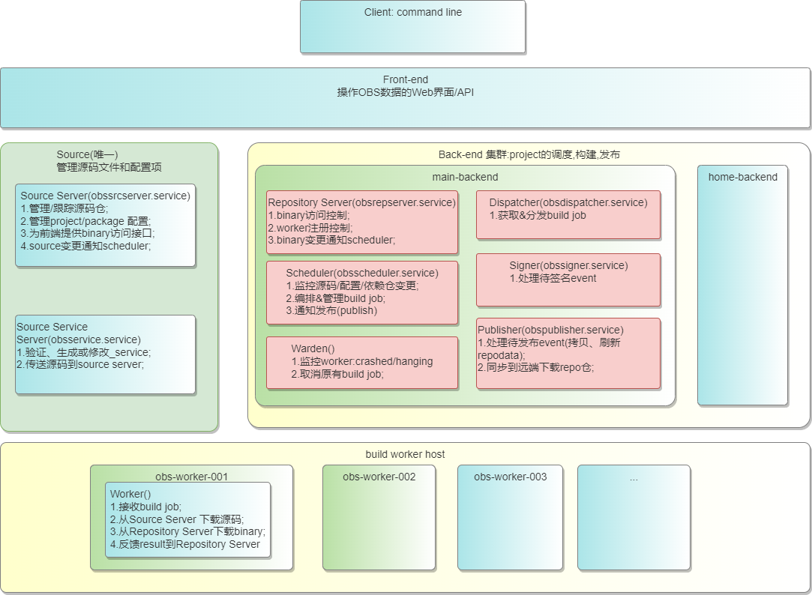

扩展back-end集群，即新增类似于main-backend的服务器，将开发分支工程、转维LTS版本/创新版本分支工程、停维版本分支工程分布式调度到扩展后的backend上去构建，不同的backend的构建策略也不一样。

需求如下：
|序号|描述|
|:--|:-------|
|1|制定project分布式调度策略|
|*2|部署backend并加入集群|
|*3|迁移project|
|*4|迁移worker|
|5|适配OBS日常维护及ISO制作的jenkins任务|
|6|适配obs_meta与OBS的同步策略，obs_meta的门禁|

## 3.需求分析
### 3.1 受益人

|角色|角色描述|
|:--|:-------|
| 版本构建人员 | 负责每日和正式版本构建|
| OBS维护人员 | 负责OBS构建系统的正常运转，版本构建jenkins任务的正常执行 |
| CI维护人员 | 负责gitee制品仓门禁 |
| 社区开发人员 | 包括在社区制品仓提交PR贡献的所有角色 |

### 3.2 定义需求场景
#### 3.2.1 工程单包构建问题频发难定界：
- openEuler当前默认的Testing工程，比如openEuler:Mainline/Epol/Factory（或者每个LTS对应的Next），这些工程对应着gitee制品仓的具体分支master，4000+的包容纳在mainline中，当出现大批量的单包构建问题时，难定界，依靠拷贝工程复现问题成本高。
- openEuler当前的release工程，比如openEuler:22.03-LTS/SPx，这些工程与Testing工程的管理方式一样，暴露问题和解决策略保持同步，空耗开发定位问题人力，增加了project维护成本。

#### 3.2.2 release-management管控版本软件包基线存在缺陷
1.	只管版本分支，不管开发分支（master/Next），导致版本分支工程软件包变更流程繁琐：https://gitee.com/openeuler/release-management/issues/I4U2VN?from=project-issue；
3.	pckg-mgmt.yaml臃肿，原来的数据结构失去意义，导致软件包变更PR提交和检视不方便；
3.	缺少对基础镜像二进制变更的管控，导致基础镜像制作失败阻塞转测；
   基础镜像二进制变更现有流程:
   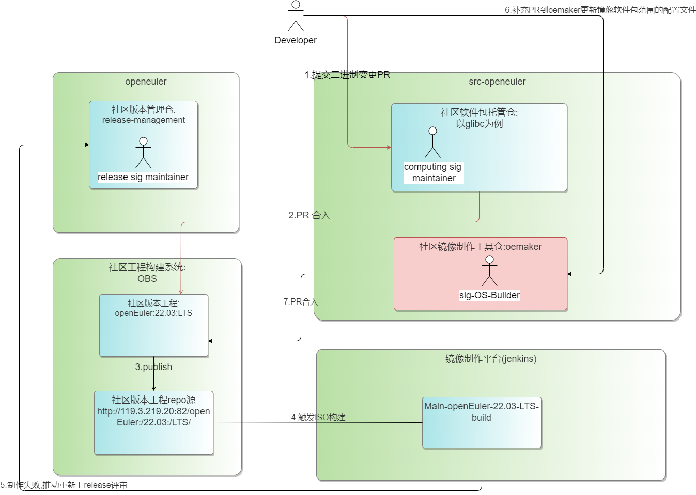

#### 3.2.3 project/package构建等待时间长：
每当多个Project需要同时构建版本时，经常看到下列的现象：
- 只有少量的project的package在building，同时worker有大量空闲（idle）；
- 大量的包在blocked状态，长时间未刷新；
- 软件包编完之后又排队需要重新构建；

上述的现象掺杂在一起就表现为“project/package构建等待时间长”。

原因分析：
1. OBS backend核心服务性能瓶颈：

	- scheduler是多进程，按照架构进行了区分（当前有aarch64/x86_64/risc-v/loongarch64等），每个架构一个进程（单线程），计算某个project时，CPU占用高于99%；
	- scheduler在计算当前的project时，会check所有需要构建的软件包并给出顺序，其他project必须等待；
	- 实际已经在building的软件包，在前台缺依然是blocked状态，可以理解为显示有延迟；

2. 待构建project及package太多，导致计算资源遇到瓶颈：
   openEuler当前开发/转维/停维/主要测试分支的project几乎都集中在main-backend，虽然构建资源可以按需增加，但是只能解决同时间段同一个工程的构建瓶颈，其计算和调度软件包构建任务的能力受限于OBS本身的架构设计无法承担若干个project同时构建需求。

## 4. 方案设计
### 4.1 分层构建：

#### 4.1.1 用例视图

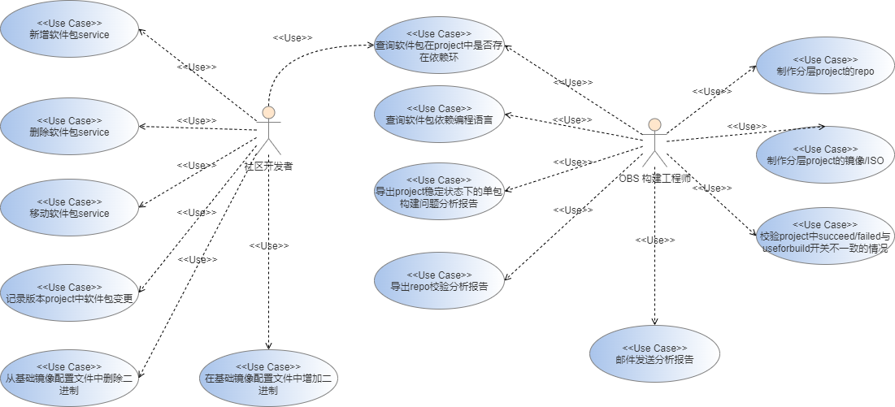

#### 4.1.2 逻辑架构图：
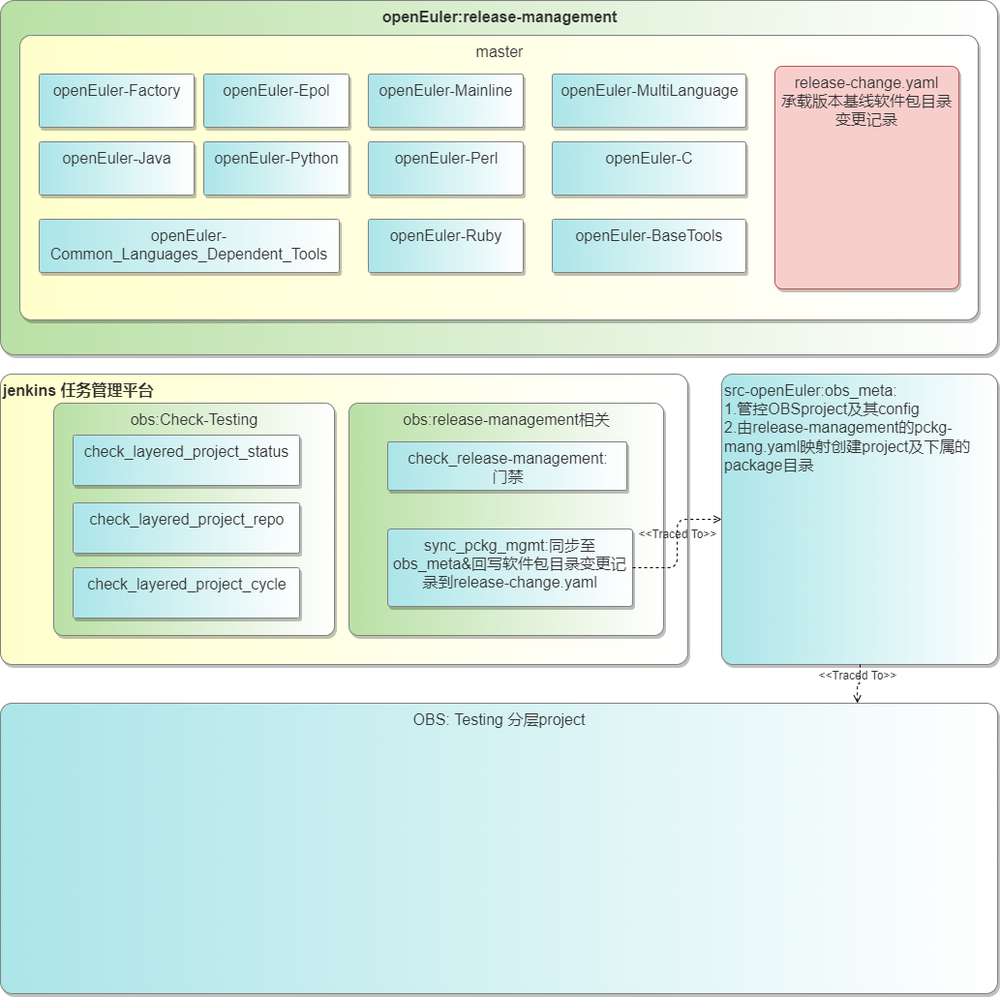

分层project构建架构图：

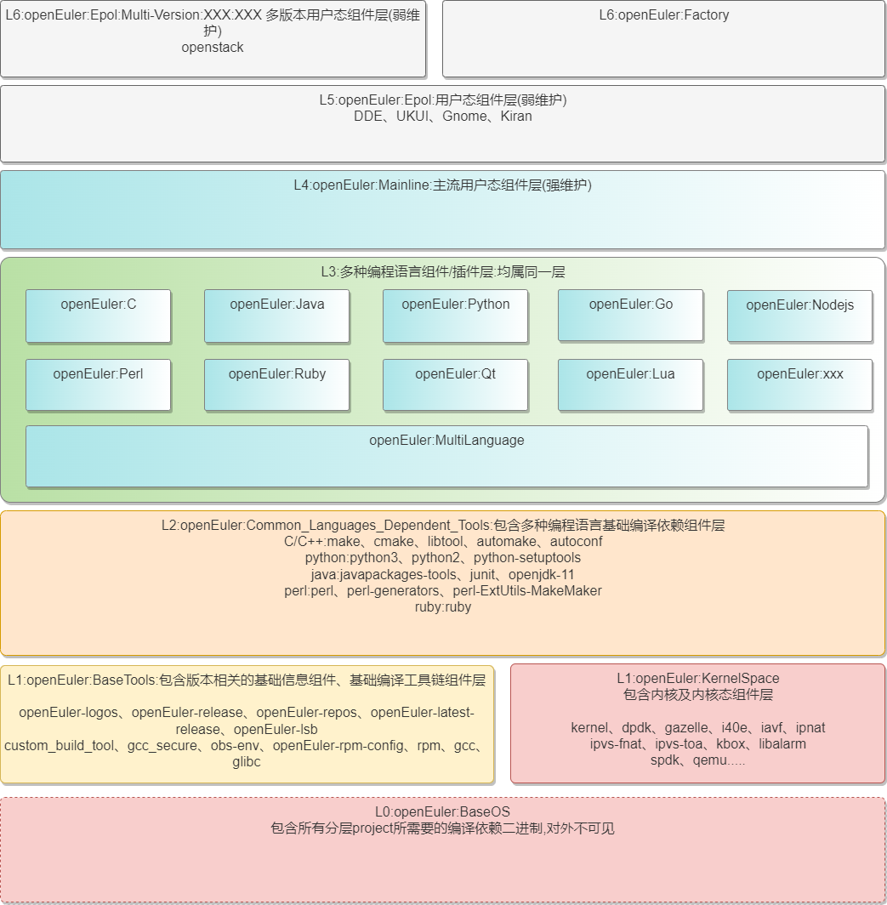

#### 4.1.3 流程图
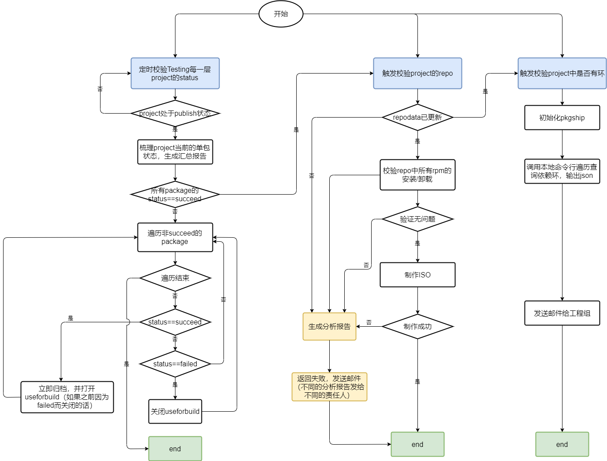

#### 4.1.4 逻辑视图&类图（待补充）

#### 4.1.5 开发者视图 （待补充）

#### 4.1.6 自底向上软件包构建分层策略
1. 工具导出master分支软件包L1层被依赖链（pkgship已支持），被依赖数目大于等于100的软件包默认放在L1/L2层；
2. 工具分析master分支软件包所属编程语言，抽象若干同层project范围，属于L3层；
3. 工具识别依赖环（pkgship已支持），由工程组主导破坏；

#### 4.1.7 分层project构建配置策略
1. Testing 各project均打开useforbuild，meta配置“rebuild=local”或者“rebuild=direct”；
   > Note:
   rebuild=local表示只有自身代码变更时触发重编；
   rebuild=direct表示只有自身或者距离为1的依赖包代码变更时，触发重编;
   
2. release工程均打开useforbuild；

#### 4.1.8 Testing&Release Project日常校验及分支代码同步策略
1. 门禁记录PR合入信息：

   master分支合入的PR会生成一条“变更影响范围”记录推送到OBS的常驻project：source_change。

2. 轮询处理source_change：
   
   基于每一条source_change记录中的软件包范围，触发
   jenkins任务：check_project_stablity，校验记录中所有包的编译状态/自编译/安装/功能测试等.

   （1）校验OK，查看当前代码同步通道是否open，若是open，则开启同步任务，将记录中涉及变更的包代码从mater分支同步到release分支；

   > Notes:校验时，如果project状态还未稳定，则跳过不处理；

   （2）校验不OK，生成测试报告，提交issue，关闭master-release分支同步通道，邮件通知社区、release sig 成员及开发者；
   
   （3）若代码同步通道closed，生成同步失败报告；
   
3. 轮询校验Testing工程：

   （1）Testing工程作为日常开发分支工程，构建最频繁，故设计轮询校验当前的工程新增的单包构建问题，进行常规的问题分析并生成报告，邮件通知开发者；

   （2）当单包构建/安装问题均闭环，启动ISO构建并跑AT，若AT成功，发布每日版本；若不成功，生成测试报告，提交issue，冻结master分支代码合入，邮件通知社区、release sig成员；

   > Note：若是第一次制作ISO没有问题，提交release决策是否启动branch新的release分支（openEuler-22.09）

4. 定时校验release工程：
   当release project处于publish状态时，触发制作ISO/镜像，同步等待AT结果：
   （1）若AT全部succeed，则发布滚动版本；
   （2）若AT有failed项，生成测试报告，提交issue，关闭master-release分支同步通道，直到阻塞问题全部解决，再重新开启；

#### 4.1.9  软件包层级变更策略（待补充）
考虑到软件包本身的依赖关系可能发生变更、清退或者初始分层不合理等场景，我们为之设计一个允许开发者提交PR来变更软件包所在层级的流程：

### 4.2 优化release软件包管控机制
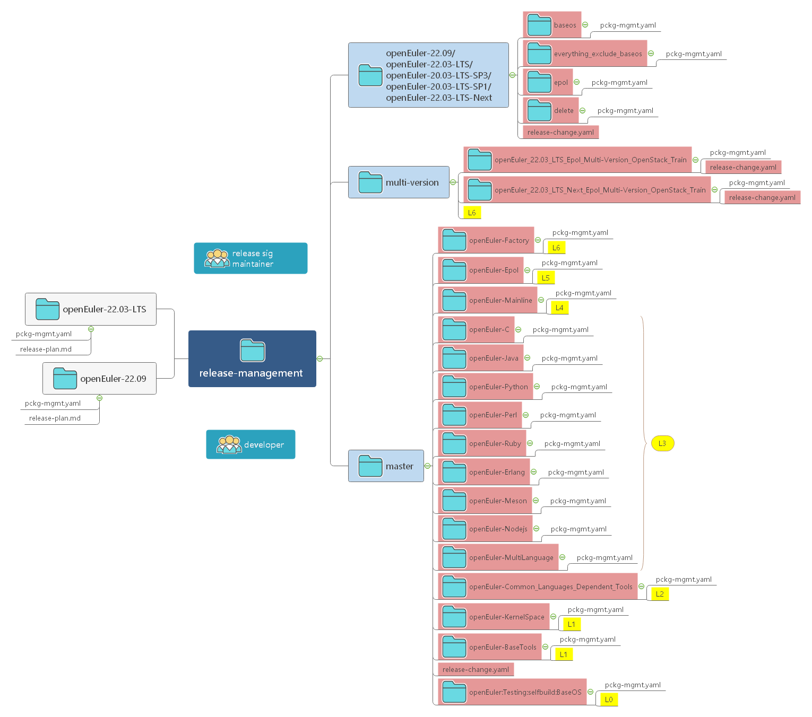

#### 4.2.1 pckg-mgnt.yaml拆分
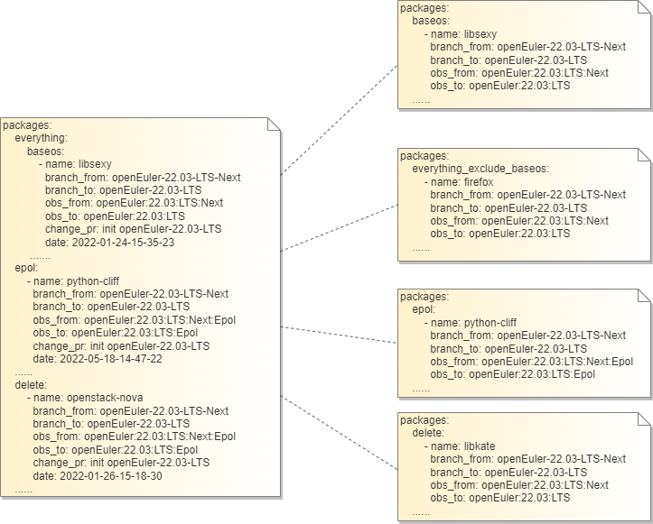

#### 4.2.2 纳管所有分支工程(master/Next/multi-version)
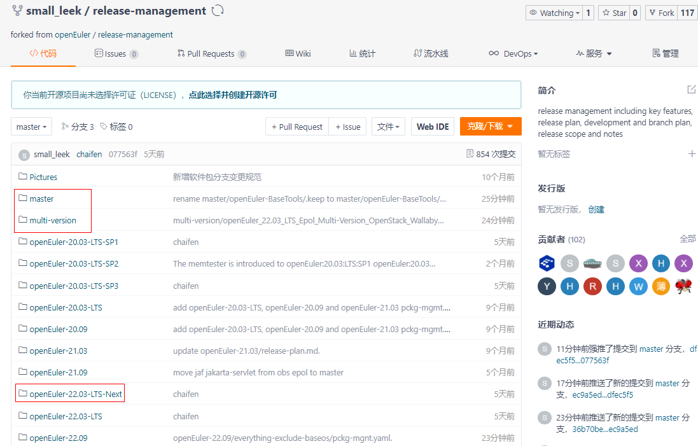

遗留问题：multi-version建议放到openEuler版本分支目录中——董杰，需要到release报一个议题：保留统一的目录还是跟随openEuler版本分支目录

#### 4.2.3 支持承载版本基线软件包变更记录

#### 4.2.4 规范版本基础镜像二进制变更流程
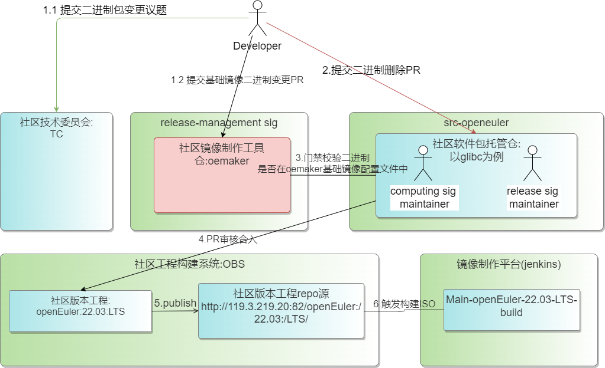

遗留问题：建议将oemaker中的二进制配置文件移交到release，功能代码保留在os-builder

关键变更点：

1. oemaker移交至release sig组；
2. 门禁识别涉及基础镜像二进制变更的PR并拦截；

### 4.3 Backend集群扩展
扩展策略新增三台back-end，加上原来的main、home，定义每一台back-end的职责和调度project的范围：
|序号|back-end|职责|project举例|
|:--|:-------|:--|:-------|
|1|main|负责master分支/LTS-Next分支相关工程构建调度|openEuler:Mainline/openEuler:Epol/openEuler:Factory|
|2|002|负责创新版本分支相关工程构建调度|openEuler:22.09/openEuler:22.09:Epol|
|3|003|负责已发布转维护版本分支相关工程构建调度|openEuler:20.03:LTS:SP1/SP3|
|4|004|负责已停维版本分支相关工程构建调度|openEuler:20.03:LTS:SP2|
|5|home|负责所有用户私有工程的构建调度|home:senlin:branches:openEuler:22.03:LTS|

此外，对于原先worker资源池的基本盘做相应的划分调整。

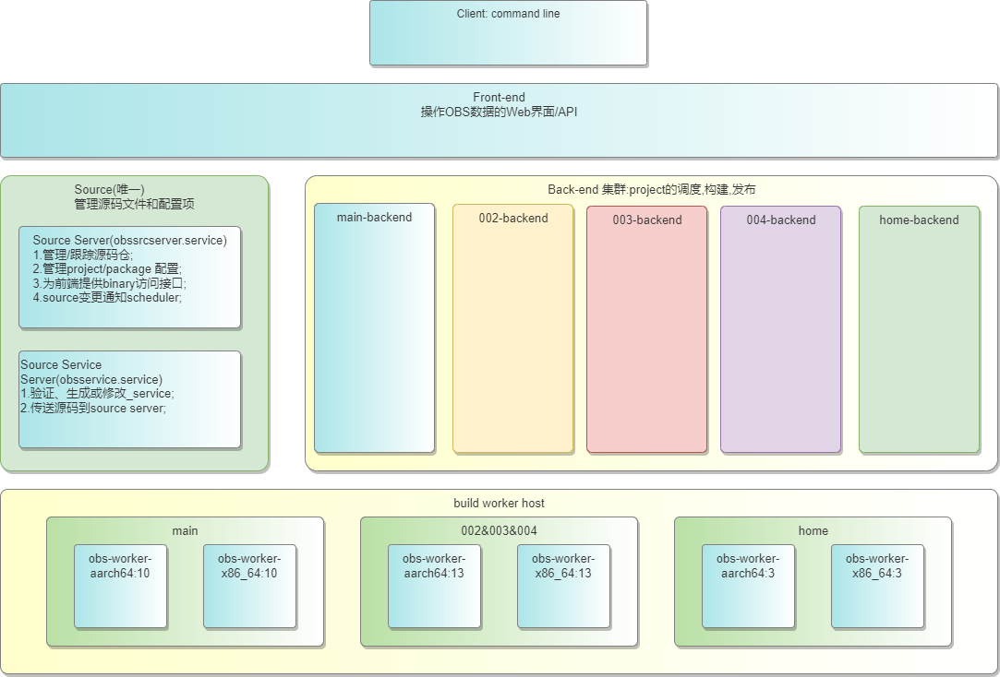

## 5. 特性清单
责任人：夏森林
开发owner：周夏香、董杰
### SR-01：支持基于软件包分层策略进行分层
描述：给定软件包分层策略表格，由工具支持自动分层，包括创建新的project、添加到已有的project、移动到其他project，所有动作最终通过修改合入到obs_meta(等到release-management整改完成后再切换)中生效。

开发语言：shell/python

| no   | AR描述                                                       | 工作量预估 | 关联jenkins任务          | 关联gitee脚本               | 责任人 |
| :--- | :----------------------------------------------------------- | :--------- | :----------------------- | :-------------------------- | :----- |
| 1    | 根据分层架构策略L1-L6，拆分mainline工程的软件包              |            | 不涉及                   | 不涉及                      | 董杰   |
| 2    | 在release-management库中新增master目录及其分层子目录，将软件包信息写入对应分层的pckg-mgmt.yaml文件中 |            | 不涉及                   | 不涉及                      | 董杰   |
| 3    | 跟据release-management库中master分层子目录的pckg-mgmt.yaml，支持在obs-meta库中增、删、改master的各分层工程目录，增、删、改各工程所有软件包的_service文件 |            | sync_pckg_mgmt           | sync_pckg_mgmt.py           | 董杰   |
| 4    | release-management门禁适配master分层工程                     |            | check_release-management | check_release_management.py | 董杰   |
| 5    | 创建所有OBS分层工程，配置新工程，进行工程构建                |            | 不涉及                   | 适配配置文件                | 周夏香 |

### SR-02：支持基于jenkins任务定时校验Testing分层project的状态
描述：当自底向上遍历Testing分层project的整体状态，当project处于“published”时，遍历当前层project的所有包的状态：
> 1.构建成功的包立即归档，并打开useforbuild，自动触发上层project构建;
> 2.构建失败的包，生成分析报告，同时关闭该包的useforbuild，其余状态按照默认useforbuild打开;

| no   | AR描述                                                       | 工作量预估（人天） | 关联jenkins任务 | 关联gitee脚本 | 责任人 |
| :--- | :----------------------------------------------------------- | :----------------- | :-------------- | :------------ | :----- |
| 1    | 工程published后，支持构建成功的包二进制归档                  | 3                  | 需要            | 优先级高      | 周夏香 |
| 2    | 工程published后，支持构建成功的包打开useforbuild，失败的包关闭useforbuild | 3                  | 需要            | 优先级高      | 周夏香 |
| 3    | 支持每日定时校验工程中哪些包的状态与useforbuild开关不同步    | 2                  | 需要            | 优先级低      | 周夏香 |
| *4   | 支持每日定时校验上一层的软件包是否基于下一层中有变更的依赖包而重新编译过 | NA                 | 需要            | NA            |        |

### SR-03：支持基于jenkins任务校验Testing分层project的repo

描述：当某一层project处于“published”时，或者手动触发该jenkins任务校验对应的repo是否可用，所有rpm安装卸载是否OK；

| no   | AR描述                                                       | 工作量预估 | 关联jenkins任务 | 关联gitee脚本 | 责任人 |
| :--- | :----------------------------------------------------------- | :--------- | :-------------- | :------------ | :----- |
| 1    | 支持校验工程对应repo中的rpm包的安装卸载（L1层所有包，其余层部分包） | 3          | 需要            |               | 王冲   |

### SR-04：支持基于Testing分层project制作 ISO

描述：当分层project所有层构建“published”，并且repo的rpm包安装卸载验证无误，则触发制作ISO的jenkins任务；

| no   | AR描述                                   | 工作量预估 | 关联jenkins任务 | 关联gitee脚本 | 责任人 |
| :--- | :--------------------------------------- | :--------- | :-------------- | :------------ | :----- |
| 1    | 支持分层project所有层构建完成后，制作ISO | NA         | 需要            |               | 王冲   |

### SR-05：支持基于jenkins任务校验校验project中是否有环

描述：当某一层project的repo可用，即“published”，或者手动触发该jenkins任务，遍历当前所有project中的所有是否存在依赖环；

| no   | AR描述                     | 工作量预估 | 关联jenkins任务 | 关联gitee脚本 | 责任人 |
| :--- | :------------------------- | :--------- | :-------------- | :------------ | :----- |
| 1    | 支持校验工程中是否有依赖环 | NA         | 需要            | 优先级低      |        |

### SR-06：支持自动生成测试分析报告并发邮件
描述：分层构建有几个测试的场景需要在生成日志后由工具自动解析并生成初步的测试报告，场景如下：

 	1. 解析unresolvable/failed/broken的软件包的detail或者原因；
 	2. 解析repo源中rpm的安装失败问题；
 	3. 解析ISO制作失败问题；
 	4. 解析AT的日志（待与测试对齐）；
遗留问题：AT测试用例失败日志或者获取及展现——刘婧婧

所有场景的分析报告，都要能自动生成邮件并发送给对应的责任人

备注：L1层的失败问题立即发送邮件，其余层问题可汇总后一起发送邮件。

| no   | AR描述                                                | 工作量预估 | 关联jenkins任务 | 关联gitee脚本 | 责任人 |
| :--- | :---------------------------------------------------- | :--------- | :-------------- | :------------ | :----- |
| 1    | 支持解析工程中软件包的构建问题，并发送邮件            | 1          | 需要            | 优先级低      | 周夏香 |
| 2    | 支持解析工程的repo源中rpm包的安装失败问题，并发送邮件 | 1          | 需要            |               | 周夏香 |
| 3    | 支持解析ISO制作失败的问题，并发送邮件                 | 1          | 需要            |               | 周夏香 |
| *4   | 支持解析AT失败日志，并发送邮件                        |            | 需要            |               |        |

## 6 遗留问题

1. Testing与release是否都要分层？
   - 均采用此分层架构：
     优点：Testing与release工程层次一一对应，便于问题暴露时快速定界反馈给同层级的Testing工程；
     缺点：release工程对应的repo比较分散，用户挂yum源时有可能需要反复切换，进行验证，另外制作ISO的jenkins任务需要适配；

   - Testing分层，release保持不变；
     优点：用户使用release工程的repo源方式不变，制作ISO的工具链不感知变化；
     缺点：当release暴露出单包构建问题时，不方便定界；
     结论：采用方案二

2. 分层 project的repo源能否整合成一个？

   可以采用opensuse的publisher的hook，自行实现拷贝rpm到指定目录的脚本，来实现多个project的repo源归一，此方式还在调研可行性。

3. 为适配分层构建，应该是单独搭建OBS还是可以只新增backend？

   当前采取新增backend的方式。

4. 当版本分支停维护之后 ，单独创建的OBS及其硬件资源如何处理？

   版本分支停维之后，相应的OBS project“封存”处理：分支冻结，project锁住，迁移至闲置的backend上管理，worker释放给其他backend使用
   
5. 构建优化方案对于社区开发者的感知有哪些操作或者流程的变化？

   遗留问题：补充开发者操作指导文档

  优化release软件包管控机制：

  (1) 所有分支工程软件包变更(增删改)从obs_meta收归release-management：开发者不再需要分别在obs_meta和release-management两个仓库提交PR来完成版本分支工程软件包变更的目的；

  (2) 版本基础镜像二进制范围的变更审核加强：开发者想要变更基础镜像二进制，再分别到oemaker和软件仓提交PR来变更二进制，如果release-management没有审核oemaker的PR，门禁会拦截软件仓变更二进制的PR；

  (3) 版本基线软件包管控配置文件（pckg-mgnt.yaml）拆分：原来的pckg-mgnt.yaml拆分成四个子目录，便于查看和检视PR；

  分层构建：
  (1) 向工程新增软件包的变化：明确进入epol的包，原流程不变；不明确的默认进入mainline；
  (2) mainline工程的变化：原来的Mainline分为L1~L4层若干个project，可以看到各层project的软件包范围没有交集；

  backend集群扩展：
  (1) project跟随新增backend之后repo地址变化：我们会在web段project的描述中显示对应的repo源地址；
  (2) 停维版本工程关闭构建：所有停维版本的工程disable处理，开发者不需要再向这些停维版本分支提交PR；

6. Testing和版本分支出滚动版本的标准有什么区别？
   Testing工程出每日版本跑AT，复用当前的AT测试项即可；
   版本分支工程出滚动版本跑AT，需要额外集成测试用例：

  	(1)L1质量层级的软件包需要保证基本功能可用/核心服务能起来；
  	*(2)相比上个版本有变更的包的自编译、安装和基本功能可用；

7. 决策点：是否需要引导社区开发者破环

和魏强讨论依赖环是否需要破解？如何破解？放到同一层还是不同层？

需要；

策略：第一阶段同当前分层策略；第二阶段针对每一有依赖的包进行处理：（1）可以使用prjconf中的ignore指令；（2）将包拆开，不常用但是引入很多依赖的功能拆倒单独的包里面，核心包保持精简的依赖。注意这里的拆开是拆到多个spec中，不是一个spec生成多subpackage，参考openSUSE:Factory的autoconf。

10. 如果开发者想要变更软件包所在层级，怎么操作？

    在release-management的master目录下提交PR变更软件包名所在目录即可
## 7 基于分层结构开发者修改提交PR流程
### 7.1 release_management目录结构

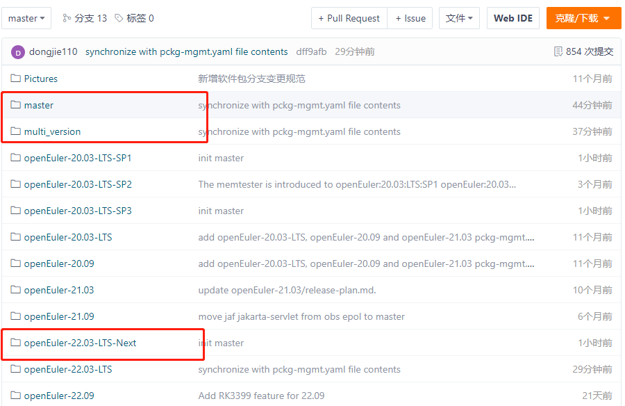

#### 7.1.1  master下目录结构以及pckg-mgmt.yaml内容解释

##### 目录结构

| 目录内容                                   | 解释                                                         |
| ------------------------------------------ | ------------------------------------------------------------ |
| delete                                     | 用于记录处理master下所有删除包，需要删除包时，只需将包名加入该目录下的pckg-mgmt.yaml中 |
| openEuler-Factory                          | 用于记录处理openEuler-Factory工程下所有包                    |
| openEuler-Mainline                         | 用于记录处理openEuler-Mainline工程下所有包                   |
| openEuler-BaseTools                        | 同上                                                         |
| openEuler-C                                | 同上                                                         |
| openEuler-Common_Languages_Dependent_Tools | 同上                                                         |
| openEuler-Epol                             | 同上                                                         |
| openEuler-Erlang                           | 同上                                                         |
| openEuler-Golang                           | 同上                                                         |
| openEuler-Java                             | 同上                                                         |
| penEuler-KernelSpace                       | 同上                                                         |
| openEuler-Lua                              | 同上                                                         |
| openEuler-Meson                            | 同上                                                         |
| openEuler-MultiLanguage                    | 同上                                                         |
| openEuler-Nodejs                           | 同上                                                         |
| openEuler-Ocaml                            | 同上                                                         |
| openEuler-Perl                             | 同上                                                         |
| openEuler-Python                           | 同上                                                         |
| openEuler-Qt                               | 同上                                                         |
| openEuler-Ruby                             | 同上                                                         |
| release_change.yaml                        | 用于记录所有包变动内容                                       |

##### pckg-mgmt.yaml字段解释

| 字段     | 解释                                                         |
| -------- | ------------------------------------------------------------ |
| name     | 包名                                                         |
| obs_from | 该包来自于OBS工程名，确保该包存在于该工程对应得obs_meta仓库目录下，否则门禁提示错误 |
| obs_to   | 该包将要移动到OBS工程名                                      |
| date     | 在yaml中修改该包的日期，修改日期必须与提交日期保持一致，否则门禁会提示错误 |

#### 7.1.2 multi_version下目录结构以及pckg-mgmt.yaml内容解释

##### 目录结构

| 目录内容                                                     | 解释                                         |
| ------------------------------------------------------------ | -------------------------------------------- |
| openEuler_22.03_LTS_Epol_Multi-Version_OpenStack_Train       | 用于记录处理该分支下所有包的增加、删除、移动 |
| openEuler_22.03_LTS_Epol_Multi-Version_OpenStack_Wallaby     | 同上                                         |
| openEuler_22.03_LTS_Next_Epol_Multi-Version_OpenStack_Train  | 同上                                         |
| openEuler_22.03_LTS_Next_Epol_Multi-Version_OpenStack_Wallaby | 同上                                         |
| ...                                                          | ...                                          |

##### pckg-mgmt.yaml字段解释

| 字段            | 解释                                                         |
| --------------- | ------------------------------------------------------------ |
| name            | 包名                                                         |
| source_dir      | 在于obs_meta仓库的哪个目录(与分支名一样)下                   |
| destination_dir | 将要复制新建到obs_meta仓库的哪个目录下                       |
| obs_from        | 该包来自于OBS工程名，确保该包存在于该工程对应的obs_meta仓库目录(source_dir/obs_from/name)下，否则门禁提示错误 |
| obs_to          | 该包将要新增到的OBS工程名,该包会新增到该工程对应得obs_meta仓库目录(destination_dir/obs_to/name)下 |
| date            | 在yaml中修改该包的日期，修改日期必须与提交日期保持一致，否则门禁会提示错误 |

#### 7.1.2 版本或开发分支目录结构以及pckg-mgmt.yaml内容解释

##### 目录结构

| 目录内容                  | 解释                                                     |
| ------------------------- | -------------------------------------------------------- |
| baseos                    | 用于记录处理该分支下所有属于baseos包的增加、移动         |
| epol                      | 用于记录处理该分支下所有属于epol包的增加、移动           |
| everything-exclude-baseos | 用于记录处理该分支下所有不属于epol和baseos包的增加、移动 |
| release-change.yaml       | 用于记录该分支下所有包变动内容                           |
| delete                    | 用于记录处理该分支下所有包的删除                         |
| ...                       | ...                                                      |

##### pckg-mgmt.yaml字段解释

| 字段            | 解释                                                         |
| --------------- | ------------------------------------------------------------ |
| name            | 包名                                                         |
| source_dir      | 在于obs_meta仓库的哪个目录(与分支名一样)下                   |
| destination_dir | 将要复制新建到obs_meta仓库的哪个目录下                       |
| obs_from        | 该包来自于OBS工程名，确保该包存在于该工程对应的obs_meta仓库目录(source_dir/obs_from/name)下，否则门禁提示错误 |
| obs_to          | 该包将要新增到的OBS工程名,该包会新增到该工程对应得obs_meta仓库目录(destination_dir/obs_to/name)下 |
| date            | 在yaml中修改该包的日期，修改日期必须与提交日期保持一致，否则门禁会提示错误 |

### 7.2 开发者提交修改流程

#### 7.2.1 master下包新增、移动、删除

##### 1.修改pckg-mgmt.yaml内容

如下：

###### 1.1从openEuler-Mainline移动metis至openEuler-Qt

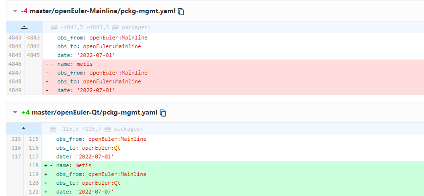

######  1.2 从master下删除两个包

​		

##### 2.创建PR提交至仓库等待门禁检查，门禁检查成功即可申请合入

 note:后台动作

 PR合入等待任务后台操作，后续会将修改先同步至obs_meta,以及同步至OBS工程

 对于要删除的包，任务会后台操作对应得yaml内容，将加入到delete的包从yaml中删除，并推送到release_management仓库

##### 3.对于所有包的移动都会记录到对应得release_change.yaml中

#### 7.2.2 multi_version下包新增、移动、删除

##### 1.修改对应pckg-mgmt.yaml

如下：

###### 1.1  在multi_version/openEuler_22.03_LTS_Epol_Multi-Version_OpenStack_Train/pckg-mgmt.yaml中新增hiredis包

###### 1.2 在multi_version/openEuler_22.03_LTS_Next_Epol_Multi-Version_OpenStack_Train/pckg-mgmt.yaml中删除python-pexpect包

##### 2.创建PR提交至仓库等待门禁检查，门禁检查成功即可申请合入

 note:后台动作

 PR合入等待任务后台操作，后续会将修改先同步至obs_meta,以及同步至OBS工程

##### 3.对于所有包的移动都会记录到对应得release_change.yaml中

#### 7.2.3 开发或者版本分支下包新增、移动、删除（pckg-mgmt.yaml已拆分）

##### 1.修改对应pckg-mgmt.yaml

如下：

###### 1.1 新增ansible-2.9至epol，分支内移动dibbler

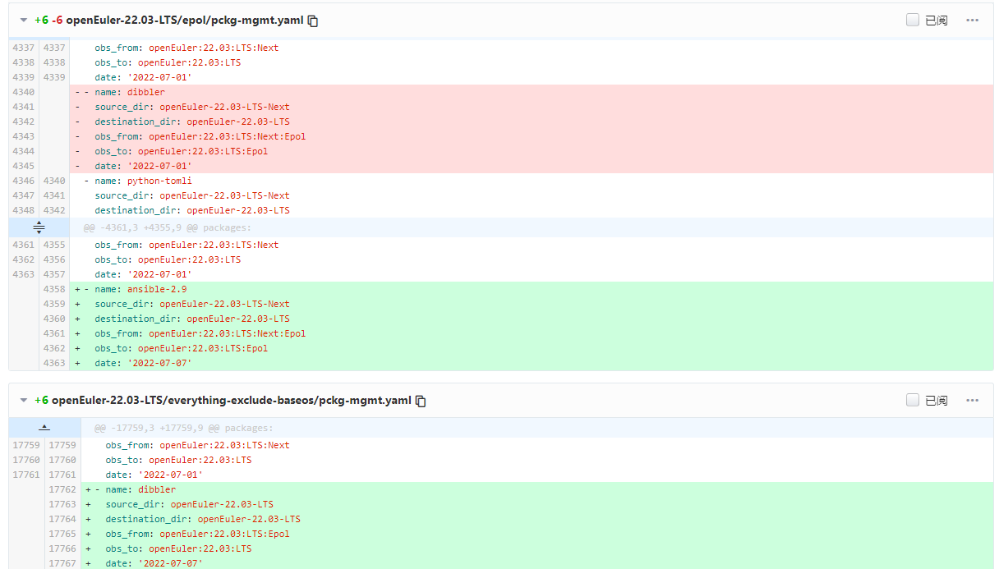

###### 1.2 删除分支内包libxcvt

##### 2.创建PR提交至仓库等待门禁检查，门禁检查成功即可申请合入

 note:后台动作

 PR合入等待任务后台操作，后续会将修改先同步至obs_meta,以及同步至OBS工程

 对于要删除的包，任务会后台操作对应得yaml内容，将加入到delete的包从yaml中删除，并推送到release_management仓库

##### 3.对于所有包的移动都会记录到对应得release_change.yaml中

#### 7.2.4 一个PR同时提交包移动到两个分支

**Note：要在同一个PR完成不同分支的包引入或移动，分支需满足以下继承规则**

https://gitee.com/openeuler/release-management/blob/master/valid_release_branches.yaml

##### 1.修改对应pckg-mgmt.yaml

如下：

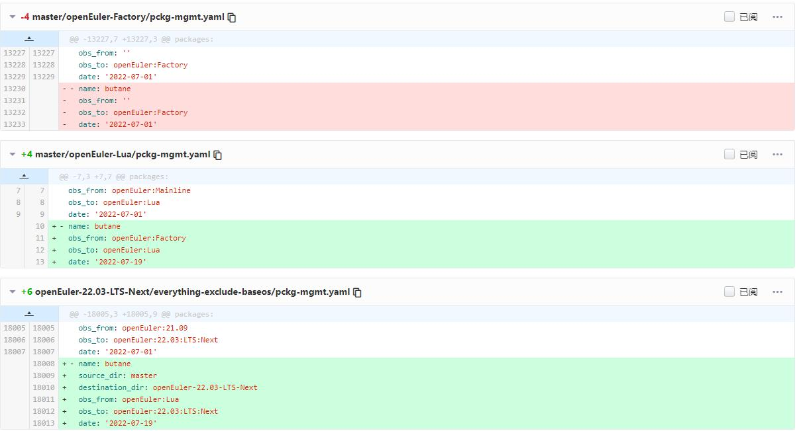

开发者想同时将包butane 1.从openEuler:Factory移动至工程openEuler:Lua 2.同时从openEuler:Lua引入至openEuler-22.03-LTS-Next，由于分支openEuler-22.03-LTS-Next和master满足分支继承规则，因此可以用一个PR同时移动

##### 2.创建PR提交至仓库等待门禁检查，门禁检查成功即可申请合入

 note:后台动作

 PR合入等待任务后台操作，后续会将修改先同步至obs_meta,以及同步至OBS工程

 对于要删除的包，任务会后台操作对应得yaml内容，将加入到delete的包从yaml中删除，并推送到release_management仓库

##### 3.对于所有包的移动都会记录到对应得release_change.yaml中

